# TodoMaster - Application Architecture Diagram

## Overview
This document presents the complete architecture of the TodoMaster cross-platform task management application, built with React Native and Expo.

## Architecture Diagram

```mermaid
graph TB
    subgraph "External Services"
        GOOGLE["🔑 Google OAuth<br/>Authentication API"]
        SENTRY["📊 Sentry<br/>Crash Reporting"]
        STORAGE["💾 AsyncStorage<br/>Local Persistence"]
    end
    
    subgraph "App Entry Point"
        APP["📱 App.js<br/>Main Application Entry"]
    end
    
    subgraph "Context Providers (State Management)"
        AUTH_CTX["🔐 AuthContext<br/>• User authentication state<br/>• Google sign-in/out<br/>• Persistent sessions"]
        TASK_CTX["📋 TaskContext<br/>• Task CRUD operations<br/>• Search & filtering<br/>• Local data management"]
    end
    
    subgraph "Navigation Layer"
        NAV["🧭 AppNavigator<br/>Stack Navigation<br/>• Auth flow routing<br/>• Screen transitions"]
    end
    
    subgraph "Screen Components"
        AUTH_SCREEN["🔑 AuthScreen<br/>• Google sign-in UI<br/>• Welcome animations<br/>• Error handling"]
        TASKS_SCREEN["📝 TasksScreen<br/>• Task list display<br/>• Search & filters<br/>• Pull-to-refresh<br/>• FAB for new tasks"]
        ADD_EDIT_SCREEN["✏️ AddEditTaskScreen<br/>• Task form<br/>• Date picker<br/>• Priority selection<br/>• Validation"]
    end
    
    subgraph "UI Components"
        TASK_ITEM["📄 TaskItem<br/>• Individual task display<br/>• Swipe gestures<br/>• Status toggle<br/>• Priority indicators"]
        EMPTY_STATE["🎭 EmptyState<br/>• No data states<br/>• Contextual messages<br/>• Action suggestions"]
        TASK_STATS["📊 TaskStats<br/>• Progress tracking<br/>• Completion percentage<br/>• Motivational messages"]
    end
    
    subgraph "Features & Interactions"
        GESTURES["👆 Gestures<br/>• Swipe to delete/edit<br/>• Pull to refresh<br/>• Tap interactions"]
        ANIMATIONS["✨ Animations<br/>• Screen transitions<br/>• List animations<br/>• Micro-interactions"]
        HAPTICS["📳 Haptic Feedback<br/>• Touch responses<br/>• Action confirmations"]
    end
    
    %% Main App Flow
    APP --> AUTH_CTX
    APP --> TASK_CTX
    APP --> SENTRY
    
    %% Context to Storage
    AUTH_CTX <--> STORAGE
    TASK_CTX <--> STORAGE
    AUTH_CTX <--> GOOGLE
    
    %% Navigation Flow
    AUTH_CTX --> NAV
    TASK_CTX --> NAV
    
    %% Screen Navigation
    NAV --> AUTH_SCREEN
    NAV --> TASKS_SCREEN
    NAV --> ADD_EDIT_SCREEN
    
    %% Screen to Context Communication
    AUTH_SCREEN <--> AUTH_CTX
    TASKS_SCREEN <--> AUTH_CTX
    TASKS_SCREEN <--> TASK_CTX
    ADD_EDIT_SCREEN <--> TASK_CTX
    
    %% UI Component Usage
    TASKS_SCREEN --> TASK_ITEM
    TASKS_SCREEN --> EMPTY_STATE
    TASKS_SCREEN --> TASK_STATS
    
    %% Feature Integration
    TASK_ITEM --> GESTURES
    TASK_ITEM --> ANIMATIONS
    TASK_ITEM --> HAPTICS
    TASKS_SCREEN --> GESTURES
    TASKS_SCREEN --> ANIMATIONS
    ADD_EDIT_SCREEN --> HAPTICS
    AUTH_SCREEN --> ANIMATIONS
    
    %% Styling
    classDef contextStyle fill:#667eea,stroke:#333,stroke-width:2px,color:#fff
    classDef screenStyle fill:#48bb78,stroke:#333,stroke-width:2px,color:#fff
    classDef componentStyle fill:#ed8936,stroke:#333,stroke-width:2px,color:#fff
    classDef serviceStyle fill:#e53e3e,stroke:#333,stroke-width:2px,color:#fff
    classDef featureStyle fill:#38a169,stroke:#333,stroke-width:2px,color:#fff
    
    class AUTH_CTX,TASK_CTX contextStyle
    class AUTH_SCREEN,TASKS_SCREEN,ADD_EDIT_SCREEN screenStyle
    class TASK_ITEM,EMPTY_STATE,TASK_STATS componentStyle
    class GOOGLE,SENTRY,STORAGE serviceStyle
    class GESTURES,ANIMATIONS,HAPTICS featureStyle
```

## Component Descriptions

### 🔵 Context Providers (State Management)
- **AuthContext**: Manages user authentication state, Google OAuth integration, and persistent login sessions
- **TaskContext**: Handles all task-related operations including CRUD operations, search functionality, and local data management

### 🟢 Screen Components
- **AuthScreen**: Beautiful login interface with Google sign-in, welcome animations, and comprehensive error handling
- **TasksScreen**: Main application dashboard featuring task list display, search & filter capabilities, pull-to-refresh functionality, and floating action button
- **AddEditTaskScreen**: Comprehensive task form with date picker, priority selection, input validation, and preview functionality

### 🟠 UI Components
- **TaskItem**: Individual task display component with swipe gestures, status toggle, priority indicators, and smooth animations
- **EmptyState**: Context-aware empty states with helpful messages and action suggestions based on current filter
- **TaskStats**: Progress tracking component with completion percentage, task statistics, and motivational messages

### 🔴 External Services
- **Google OAuth**: Secure authentication service integration for user sign-in
- **Sentry**: Comprehensive crash reporting and error tracking service
- **AsyncStorage**: Local data persistence layer for offline functionality

### 🟢 Features & Interactions
- **Gestures**: Swipe-to-delete/edit, pull-to-refresh, and intuitive tap interactions
- **Animations**: Smooth screen transitions, list animations, and delightful micro-interactions
- **Haptic Feedback**: Tactile responses for user actions and confirmations

## Data Flow Architecture

1. **Application Entry**: App.js initializes all context providers and external services
2. **State Management**: Context providers manage global state and handle communication with AsyncStorage
3. **Navigation**: AppNavigator routes between screens based on authentication state and user actions
4. **Screen Rendering**: Individual screens consume context data and render appropriate UI components
5. **User Interactions**: UI components handle user interactions and trigger appropriate context updates

## Design Patterns Used

- **Provider Pattern**: For global state management using React Context
- **Component Composition**: Modular, reusable UI components
- **Separation of Concerns**: Clear separation between business logic, UI, and data layers
- **Responsive Design**: Adaptive layouts for different screen sizes and orientations

---

**Project**: TodoMaster - Cross-Platform Task Management App  
**Framework**: React Native with Expo  
**Architecture**: Context-based State Management with Local Persistence  
**Date**: 2025

This project is a part of a hackathon run by https://www.katomaran.com 